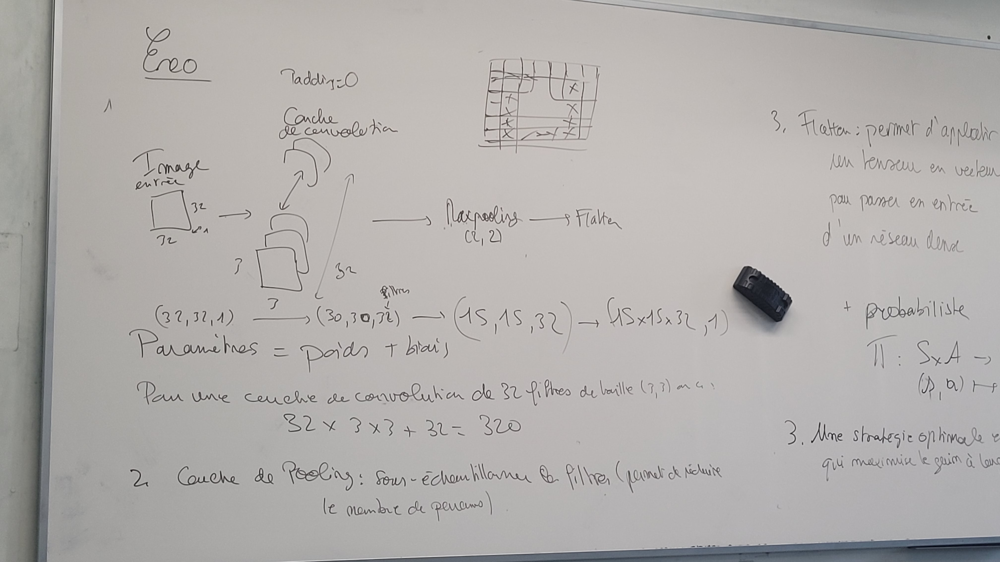

# Question de cours

## 1 énumérez les différences les plus importantes entre les réseaux de neurones standards et les réseaux de neurones convolutifs

les réseaux de neuronnes convolutifs sont plus souvent utilisé dans l'analyse d'image puisqu'il ne sont pas totalement connecté, ils sont connectés a des zones locales de la couche précédente ce qui leur permet d'apprendre des  motifs locaux

## 2 Recuit simulé
### (a) Dans le cas d’une décroissance de température géométrique, décrire l’impact de la valeur du paramètre de décroissance 

Valeur élevée:
    Convergence plus rapide.
    Risque accru de rester coincé dans un optimum local.

Valeur faible:
    Convergence plus lente.
    Meilleure chance de trouver un optimum global.

### (b) Expliquer le principe de l’évaluation de la différence de score entre un candidat et son voisin et l’utilisation du critère de Métropolis
on analyse les positions du candidat par rapport a celui de son voisin si le voisin a une meilleur positions on l'accepte sinon on le rejete.
Le critère de metropolis lui permet de temps en temps d'accepter un voisin que l'on aurait rejeté pour possiblement sortir d'un minimas local

### (c) Pourquoi l’algorithme du recuit simulé converge-t-il?

# Apprentissage par renforcement

## Sujet :
On considère un agent qui se d ́eplace sur le terrain de la figure 1 dans lequel la case verte (en bas à droite) repr ́esente un objectif et les 3 cases noires des obstacles

## 1 Proposez une modélisation (détaillée et argumentée) de ce problème.

État: La position de l'agent sur la grille (x, y)
ETATS : s= {16 états désignées par des coord(xi,yi) ; 0<= xi <=3 et 0<= y <=3}

Action: Déplacement de l'agent dans l'une des quatre directions A = (haut, bas, gauche, droite) 

Récompense:
- +2 : Si l'agent atteint la case verte
- -2 : Si l'agent heurte un obstacle 
- -5 : Si l'agent se conduisant vers l'extérieur
- 0 : Sinon
Fonction de transition: Détermine la probabilité de l'agent d'atteindre un nouvel état en fonction de l'action choisie et de l'état actuel.

Environnement: Déterministe, car la fonction de transition est connue et ne dépend pas d'aléas.

## 2 Qu’est-ce qu’une stratégie ? Donnez un exemple de stratégie dans ce problème.
Une stratégie est un plan d'action qui détermine quelle action l'agent doit choisir dans chaque état possible.
+ Deterministe
strat: S -->A
+ Probaliste 
strat: S*A -->S

Exemple de stratégie:
Si l'agent est en haut à gauche, aller à droite.
Si l'agent est en haut à droite, aller en bas.
Si l'agent est en bas à gauche, aller en haut.
Si l'agent est en bas à droite, rester immobile.

## 3 Quand est-ce qu’une strat ́egie est qualifi ́ee d’optimale?
Une stratégie optimale est une strategie qui maximise le gain a long terme

## 4 Pouvez-vous ‘deviner’ dans ce cas la stratégie optimale ? (vous justifierez, bien entendu, votre réponse)
S(0.0) haut
S(0.1) droite
S(1.1) droite
S(2.1) droite
S(3.1) bas

## 5 Quel algorithme, et de quelle manière, peut trouver cette stratégie ?

# Deep learning

## Sujet :
Dans cet exercice, nous consid ́erons le probl`eme de la reconnaissance des chiens et des chats sur des images. Nous supposons dans un premier temps que les images sont en niveau de gris (comme celles vues en TD) et qu’elles sont de taille 32 ×32. Nous cr ́eons pour cela un r ́eseau de neurones convolutif (ConvNet) ayant une couche de convolution contenant 32 tableaux de neurones et utilisant des filtres de taille 3 ×3, une couche Maxpooling et une couche Flatten.

## 1 Calculez le nombre de paramètres de la couche de convolution.

Paramètres = poids + biais
Pour une couche de convolution de 32 filtres de taille (3.3) on a:
- 32 * 3 * 3 + 32 = 320

## 2 Rappelez le rôle de la couche de Pooling et donnez sa taille.
Couche de pooling sous échantillonner les filtres(permet de réduire le nombre de paramètres)

## 3 Rappelez l’utilité de la couche Flatten et donnez sa taille.
Flatten : permet d'applatir un tenseur en vecteur pour passer en entrée d'un réseau dense

## 4 Quels sont le nombre de neurones, le nombre de paramètres et la fonction d’activation de la couche de sortie dans les cas suivants (vous justifierez, bien entendu, vos réponses) :

### (a) Chaque image contient obligatoirement soit un chien soit un chat (mais pas les deux).
- 1 neurone car classification binaire 
- nombre de params: 15 * 15 * 23 + 1
- fonction d'activation : Sigmoïde

### (b) Nous avons un troisième type d’images ne contenant ni un chat ni un chien.
- 3 neurone car 3 classes
- nombre de params : 3 * 15 * 15 * 32 + 3
- fonction d'activation : softmax

### (c) Chaque image contient obligatoirement un chien ou un chat (ou les deux). 
- 2 neuronnes car 2 classes qui ne s'excluent pas
- nombre de params : 2 * 15 * 15 * 32 + 2
- fonction d'activation : sigmoïde

## Sujet : 
Supposons maintenant que les images sont en couleurs (RGB, ce qui est souvent le cas dans les probl`emes r ́eels). Chaque pixel est donc d ́efini par un triplet de réels.

## 5 Qu’est-ce que cela change dans l’architecture du réseau ?

Paramètres = poids + biais
Pour une couche de convolution de 32 filtres de taille (3.3.3) on a:
- 32 * 3 * 3 * **3** *  + 32 = 320
